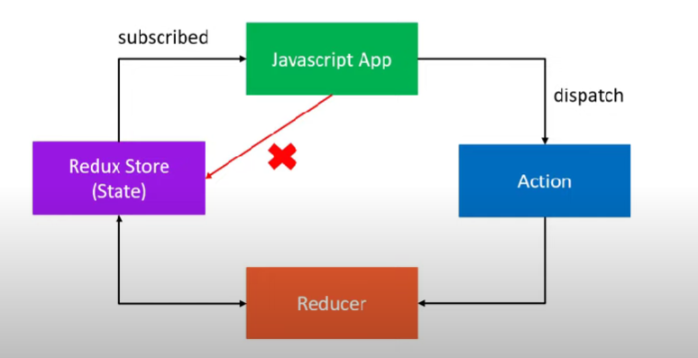

# Three core concepts
## Cake shop
### Entities
* Shop - Stores cakes on a shelf
* Shopkeeper - Behind the counter
* Customer - At the store entrance

### Activities
* Customer - Order a cake
* Shopkeeper - Box a cake from the shelf
* - Receipt to keep track

# Three core concepts continued.
| Cake Shop Scenario | Redux   | Purpose                             |
|--------------------|---------|-------------------------------------|
| Shop               | Store   | Holds the state of your application |
| Cake ordered       | Action  | Describes what happened             |
| Shopkeeper         | Reducer | Ties the store and actions together |

* A store that holds the state of your application
* An action that describes what happened in the application
* A reducer which handles the action and decides how to update the state

# Three principles
## First principle

**"The global state of your application is stored as an object inside a single store"**

Maintain our application state in a single object which would be managed by the Redux store

Cake shop\
Let's assume we are tracking the number of cakes on the shelf
```javascript
{
  numberOfCakes: 10
}
```

## Second Principle

**"The only way to change the state is to dispatch an action, an object that describes what
happened"**

To update the state of your app, you need to let Redux know about that with an action
Not allowed to directly update the state object

Cake Shop

Scan the QR code and place an order - CAKE_ORDERED

```javascript
{ 
  type: 'CAKE_ORDERED'
}
```

## Third Principle
**"To specify how the state tree is updated based on actions, you write pure reducers"**

Reducer - (previousState, action) => newState

Cake Shop

Reducer is the shopkeeper

```javascript
const reducer = (state = initialState, action) => {
  switch (action.type) {
    case CAKE_ORDERED:
      return {
        numOfCakes: state.numOfCakes - 1
      }
  }
}
```



# Actions
* The only way your application can interact with the store
* Carry some information from your app to the redux store
* Plain JavaScript objects
* Have a **type** property that describes something that happened in the application
* The **type** property is typically defined as string constants

# Reducers
Specify how the app’s state changes in response to actions sent to the store

Function that accepts state and action as arguments, and returns the next state of the application

(previousState, action) => newState